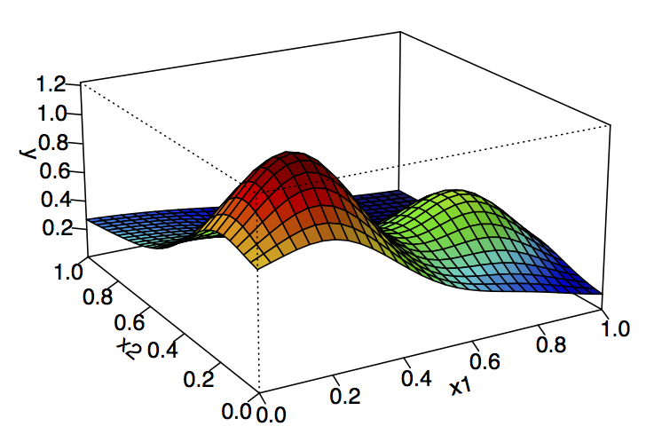

# STAT545-hw01-Rodriguez-Arelis-Alexi
# Homework 01: Edit README.md and Use R Markdown

Hello TA's/Instructor,

This is my repository for Homework 1.

I made all the changes using my repository local version on RStudio, i.e.: pull, edit locally, save, commit, push to github.com.

Now, I'm trying some features on the README file:

- *Italics*.
- **Bold**.
- ~~Strikeout.~~
  + Nested bullets.
    * Even more nested.

### My R Code
    
This a function I use for handling my simulation databases:
```R
get.N.RMSE <- function(results, Type ,Approach, Software)
{
  results <- cbind(results, c(rep(Type, nrow(results))),
                   c(rep(Approach, nrow(results))), 
                   c(rep(Software, nrow(results))))
  colnames(results)[6:ncol(results)] <- c("N_RMSE", "Type", "Approach", "Software")
  results <- results[, c(1:3, 6:ncol(results))]
  return(results)
}
```

### Image



### Link

[Link to the main STAT545 webpage.](http://stat545.com)

Cheers,

Alexi

