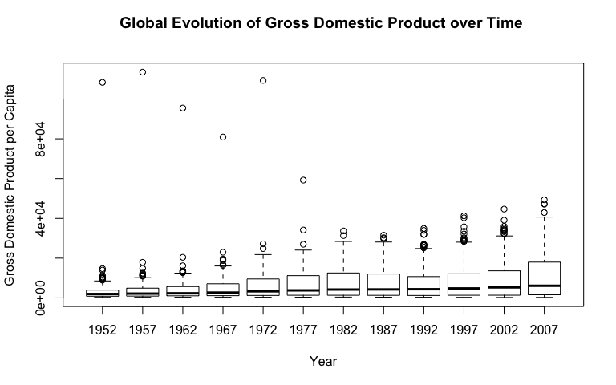
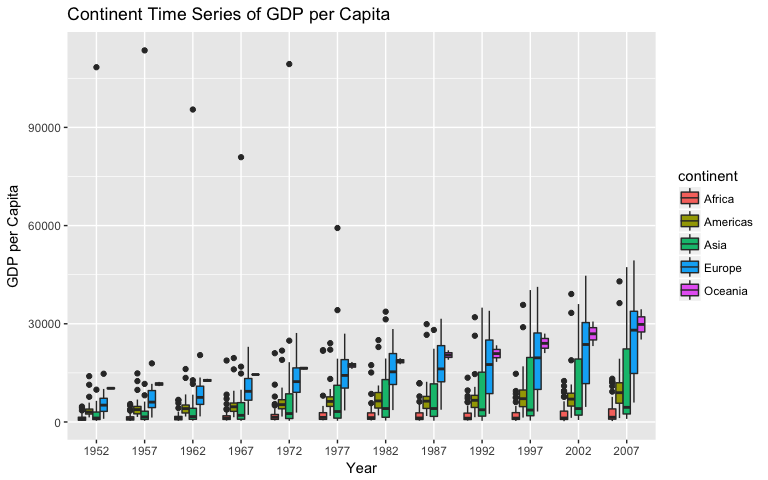
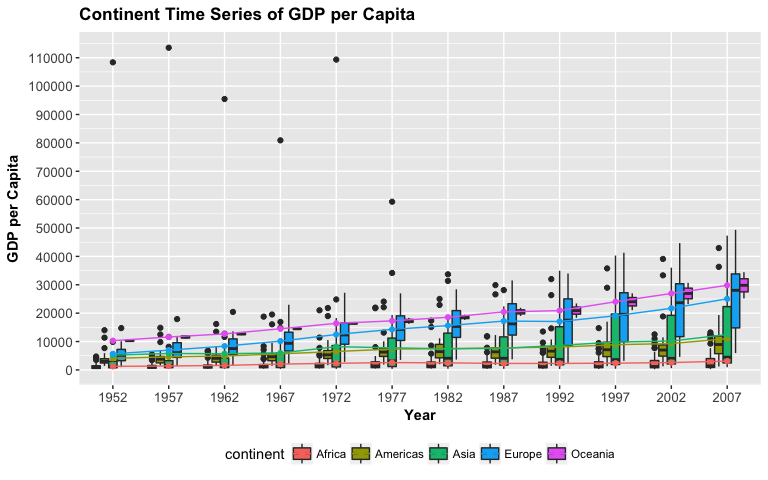
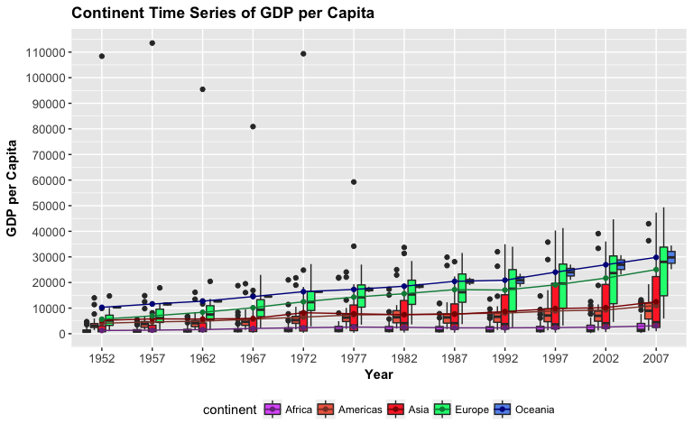

HW2- Explore Gapminder and use dplyr
================
Alexi Rodriguez-Arelis
25/9/2017

``` r
knitr::opts_chunk$set(echo = TRUE)
```

Loading Libraries
-----------------

First of all, we need to load the corresponding libraries.

``` r
library(gapminder)
library(tidyverse)
```

    ## Loading tidyverse: ggplot2
    ## Loading tidyverse: tibble
    ## Loading tidyverse: tidyr
    ## Loading tidyverse: readr
    ## Loading tidyverse: purrr
    ## Loading tidyverse: dplyr

    ## Conflicts with tidy packages ----------------------------------------------

    ## filter(): dplyr, stats
    ## lag():    dplyr, stats

``` r
library(ggplot2)
```

Smell Test the Data
-------------------

Now, we proceed with the primary dataset exploration.

*1. Is it a data.frame, a matrix, a vector, a list?*

``` r
typeof(gapminder)
```

    ## [1] "list"

Using function `typeof()`, we can see that `gapminder` is a `list`.

*2. What’s its class?*

``` r
class(gapminder)
```

    ## [1] "tbl_df"     "tbl"        "data.frame"

Function `class()` tells us that `gapminder` is a `tibble`, a class of `data.frame`.

*3. How many variables/columns?*

``` r
ncol(gapminder)
```

    ## [1] 6

With `ncol()` we can get the number of columns or variables, 6.

*4. How many rows/observations?*

``` r
nrow(gapminder)
```

    ## [1] 1704

With `nrow()` we can get the number of rows or observations, 1704.

*5. Can you get these facts about “extent” or “size” in more than one way? Can you imagine different functions being useful in different contexts?*

``` r
dim(gapminder)
```

    ## [1] 1704    6

Function `dim` provides the number of rows and columns in a single vector.

*6. What data type is each variable?*

``` r
str(gapminder)
```

    ## Classes 'tbl_df', 'tbl' and 'data.frame':    1704 obs. of  6 variables:
    ##  $ country  : Factor w/ 142 levels "Afghanistan",..: 1 1 1 1 1 1 1 1 1 1 ...
    ##  $ continent: Factor w/ 5 levels "Africa","Americas",..: 3 3 3 3 3 3 3 3 3 3 ...
    ##  $ year     : int  1952 1957 1962 1967 1972 1977 1982 1987 1992 1997 ...
    ##  $ lifeExp  : num  28.8 30.3 32 34 36.1 ...
    ##  $ pop      : int  8425333 9240934 10267083 11537966 13079460 14880372 12881816 13867957 16317921 22227415 ...
    ##  $ gdpPercap: num  779 821 853 836 740 ...

The 6 variables are described as follows:

-   `country`: A factor with 142 levels (all countries in `gapminder`).
-   `continent`: A factor with 5 levels (continents of the world, except Antarctica).
-   `year`: A factor providing the years of the respective figures.
-   `lifeExp`: A decimal value in years of life expectancy per `country` and `year`.
-   `pop`: An integer value of the population per `country` and `year`.
-   `gdpPercap`: A decimal value of the gross domestic product per capita, per `country` and `year`.

Explore Individual Variables
----------------------------

In terms of the quantitative variable, we pick `gdpPercap`.

``` r
summary(gapminder$gdpPercap)
```

    ##     Min.  1st Qu.   Median     Mean  3rd Qu.     Max. 
    ##    241.2   1202.1   3531.8   7215.3   9325.5 113523.1

Function `summary()` provides the range of this quantitative variable, as well as the respective measures of spread. If we want to plot the corresponding information in a suitable way, we could use side-by-side boxplots. Furthermore, we can also take into account the variable `year` in order to track the evolution over time. Note that we aren't providing a detailed analysis (yet!).

``` r
boxplot(gdpPercap ~ year, data = gapminder, main = "Global Evolution of Gross Domestic Product over Time \n", xlab = "Year", ylab = "Gross Domestic Product per Capita")
```



Function `boxplot()` provides "not so cool" side-by-side boxplots, unlike `ggplot2`. Although, we can see that as time goes by the spread gets larger and larger. This suggests that there might be differences in `gdpPercap`, if we explore the dataset more in detail (possibly by `continent`?). Hence, before starting with the good stuff (`ggplot2`), we can get a table of the categorical variable `continent`.

``` r
table(gapminder$continent)
```

    ## 
    ##   Africa Americas     Asia   Europe  Oceania 
    ##      624      300      396      360       24

Note that the number of countries per `continent` is highly variable, which might require a further plotting analysis in `gdpPercap`. This analysis will require tools provided by package `dplyr`.

Explore Various Plot Types
--------------------------

`ggplot2` offers useful plotting tools that allow us to get a better sense on how our dataset is behaving. Variable `gdpPercap` can be plotted in different ways, while subsetting our data with `dplyr`. We can start out with a time series depicting side-by-side boxplots per continent (since, we already plotted a global time series in the previous section), as well as the corresponding annual means in the form of line with points per year.

``` r
time.gdp.continent <- ggplot(gapminder, aes(x = as.factor(year), y = gdpPercap)) + xlab ("Year") + ylab("GDP per Capita") + ggtitle("Continent Time Series of GDP per Capita")
time.gdp.continent
```


The first layer doesn't containt any plots yet, it only sets up the plotting field. Now, we will add the side-by-side continent boxplots in a yearly time series. Note we're using `as.factor(year)` in order to change this integer variable into a factor.

``` r
time.gdp.continent <- time.gdp.continent + geom_boxplot(aes(fill = continent))
time.gdp.continent
```



The aesthetics don't seem entirely appropriate. Thus, we will use the following code to fix up the axes, titles and legend:

``` r
time.gdp.continent <- time.gdp.continent + theme(legend.position = "bottom")
time.gdp.continent <- time.gdp.continent + theme(axis.text.x = element_text(size = 10),
                                                 axis.text.y = element_text(size = 10),
                                                 axis.title = element_text(size = 11, face = "bold"),
                                                 plot.title = element_text(size = 13, face = "bold"))
time.gdp.continent <- time.gdp.continent + scale_y_continuous(breaks = seq(0, 120000, 10000)) 
time.gdp.continent
```


Now, we add annual means in the form of lines with points per year with `stat_summary()`:

``` r
time.gdp.continent <- time.gdp.continent + stat_summary(fun.y = mean, geom = "line", aes(group = factor(continent), colour = factor(continent))) 
time.gdp.continent <- time.gdp.continent + stat_summary(fun.y = mean, geom = "point",  aes(group = factor(continent), colour = factor(continent)))
time.gdp.continent
```



We still need to fix up the legends and colours with the following code:

``` r
time.gdp.continent <- time.gdp.continent + labs(shape = "continent", colour = "continent")
################################
# Character vectors for colors
boxplot_colors <- c("mediumorchid1", "coral2", "firebrick1", "springgreen", "cornflowerblue")
line_colors <- c("mediumorchid4", "coral4", "red4", "springgreen4", "darkblue")
################################
time.gdp.continent <- time.gdp.continent + scale_fill_manual(values = boxplot_colors) + scale_color_manual(values = line_colors)
time.gdp.continent
```



Finally, the plot looks nice and shows us that the continent with the lowest GDP's over time is Africa, despite it is composed of 624 countries. Compared to 360 European countries, the differences are concerning.
