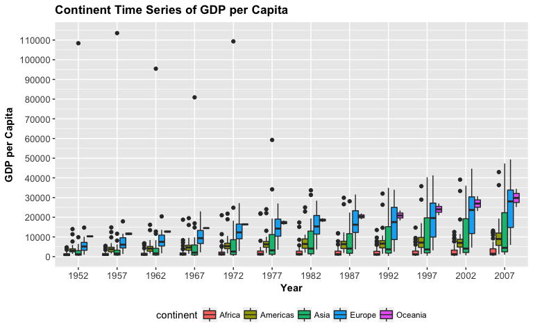

HW3- Use `dplyr` to manipulate and explore data (also use `ggplot2`)
================
Alexi Rodriguez-Arelis
29/9/2017

Loading Libraries
-----------------

First of all, we need to load the corresponding libraries.

``` r
suppressPackageStartupMessages(library(tidyverse))
suppressPackageStartupMessages(library(gapminder))
knitr::opts_chunk$set(fig.width = 8, fig.height = 5)
```

Tasks
-----

### *1. Get the maximum and minimum of GDP per capita for all continents.*

The task doesn't specify whether they should be a global maximum and minimum GDP per capita (timeless) or not. Since I'm feeling inspired, I'll create a time series with the maximum and minimum per continent in order to check how the gap evolves in each continent over time. That sounds exciting!

I need to create a grouped table by `continent` **and** `year` with `group_by()`, along with `summarize()` using functions `min()` and `max()`.

``` r
task_1_table <- gapminder %>%
  group_by(continent, year) %>% 
  summarize(Minimum = min(gdpPercap), Maximum = max(gdpPercap))
```

This produces the following table:

``` r
knitr::kable(task_1_table)
```

| continent |  year|     Minimum|     Maximum|
|:----------|-----:|-----------:|-----------:|
| Africa    |  1952|    298.8462|    4725.296|
| Africa    |  1957|    335.9971|    5487.104|
| Africa    |  1962|    355.2032|    6757.031|
| Africa    |  1967|    412.9775|   18772.752|
| Africa    |  1972|    464.0995|   21011.497|
| Africa    |  1977|    502.3197|   21951.212|
| Africa    |  1982|    462.2114|   17364.275|
| Africa    |  1987|    389.8762|   11864.408|
| Africa    |  1992|    410.8968|   13522.158|
| Africa    |  1997|    312.1884|   14722.842|
| Africa    |  2002|    241.1659|   12521.714|
| Africa    |  2007|    277.5519|   13206.485|
| Americas  |  1952|   1397.7171|   13990.482|
| Americas  |  1957|   1544.4030|   14847.127|
| Americas  |  1962|   1662.1374|   16173.146|
| Americas  |  1967|   1452.0577|   19530.366|
| Americas  |  1972|   1654.4569|   21806.036|
| Americas  |  1977|   1874.2989|   24072.632|
| Americas  |  1982|   2011.1595|   25009.559|
| Americas  |  1987|   1823.0160|   29884.350|
| Americas  |  1992|   1456.3095|   32003.932|
| Americas  |  1997|   1341.7269|   35767.433|
| Americas  |  2002|   1270.3649|   39097.100|
| Americas  |  2007|   1201.6372|   42951.653|
| Asia      |  1952|    331.0000|  108382.353|
| Asia      |  1957|    350.0000|  113523.133|
| Asia      |  1962|    388.0000|   95458.112|
| Asia      |  1967|    349.0000|   80894.883|
| Asia      |  1972|    357.0000|  109347.867|
| Asia      |  1977|    371.0000|   59265.477|
| Asia      |  1982|    424.0000|   33693.175|
| Asia      |  1987|    385.0000|   28118.430|
| Asia      |  1992|    347.0000|   34932.920|
| Asia      |  1997|    415.0000|   40300.620|
| Asia      |  2002|    611.0000|   36023.105|
| Asia      |  2007|    944.0000|   47306.990|
| Europe    |  1952|    973.5332|   14734.233|
| Europe    |  1957|   1353.9892|   17909.490|
| Europe    |  1962|   1709.6837|   20431.093|
| Europe    |  1967|   2172.3524|   22966.144|
| Europe    |  1972|   2860.1698|   27195.113|
| Europe    |  1977|   3528.4813|   26982.291|
| Europe    |  1982|   3630.8807|   28397.715|
| Europe    |  1987|   3738.9327|   31540.975|
| Europe    |  1992|   2497.4379|   33965.661|
| Europe    |  1997|   3193.0546|   41283.164|
| Europe    |  2002|   4604.2117|   44683.975|
| Europe    |  2007|   5937.0295|   49357.190|
| Oceania   |  1952|  10039.5956|   10556.576|
| Oceania   |  1957|  10949.6496|   12247.395|
| Oceania   |  1962|  12217.2269|   13175.678|
| Oceania   |  1967|  14463.9189|   14526.125|
| Oceania   |  1972|  16046.0373|   16788.629|
| Oceania   |  1977|  16233.7177|   18334.198|
| Oceania   |  1982|  17632.4104|   19477.009|
| Oceania   |  1987|  19007.1913|   21888.889|
| Oceania   |  1992|  18363.3249|   23424.767|
| Oceania   |  1997|  21050.4138|   26997.937|
| Oceania   |  2002|  23189.8014|   30687.755|
| Oceania   |  2007|  25185.0091|   34435.367|

Using `task_1_table`, we can plot the `Minimum` and `Maximum` in a time series:

``` r
task_1_plot <- ggplot(task_1_table, aes(x = year)) +
  xlab ("Year") + ylab("GDP per Capita") + 
  scale_x_continuous(breaks = seq(min(task_1_table$year), max(task_1_table$year), 5)) +
  ggtitle("Time Series of Minimum and Maximum GDP per Capita\n per Continent") +
  geom_line(aes(y = Minimum, colour = "Minimum")) +
  geom_line(aes(y = Maximum, colour = "Maximum")) +
  geom_point(aes(y = Minimum, colour = "Minimum")) + 
  geom_point(aes(y = Maximum, colour = "Maximum")) +
  theme(legend.position = "bottom") + 
  facet_grid(~ continent) +
  theme(axis.text.x = element_text(size = 7, angle = 90),
        axis.text.y = element_text(size = 10),
        axis.title = element_text(size = 11, face = "bold"),
        plot.title = element_text(size = 13, face = "bold"),
        strip.text.x = element_text(size = 11, face = "bold")) +
  theme(legend.title = element_blank()) +
  scale_y_continuous(breaks = seq(0, max(gapminder$gdpPercap), 10000)) 
task_1_plot
```


Before analizing the plot, note the following:

``` r
countries_per_continent <- gapminder %>% group_by(continent) %>% summarize(Number = n_distinct(country))
knitr::kable(countries_per_continent)
```

| continent |  Number|
|:----------|-------:|
| Africa    |      52|
| Americas  |      25|
| Asia      |      33|
| Europe    |      30|
| Oceania   |       2|

Oceania has 2 countries in the dataset, and its gap is narrow over the years even though it gets wider at the end of the series. This suggests that inequality between these two countries is not that serious. However, when it comes to the Americas and Europe, inequality gets larger over time which is concerning. In terms of Africa, we can see that the gap is not large but the figures for the maximum are pretty small when compared to other continents.

### *2. Look at the spread of GDP per capita within the continents.*

In order to this, we can start by extracting the corresponding information from `gapminder`:

``` r
task_2_table <- select(gapminder, continent, country, year, gdpPercap)
knitr::kable(task_2_table[1:20,])
```

| continent | country     |  year|  gdpPercap|
|:----------|:------------|-----:|----------:|
| Asia      | Afghanistan |  1952|   779.4453|
| Asia      | Afghanistan |  1957|   820.8530|
| Asia      | Afghanistan |  1962|   853.1007|
| Asia      | Afghanistan |  1967|   836.1971|
| Asia      | Afghanistan |  1972|   739.9811|
| Asia      | Afghanistan |  1977|   786.1134|
| Asia      | Afghanistan |  1982|   978.0114|
| Asia      | Afghanistan |  1987|   852.3959|
| Asia      | Afghanistan |  1992|   649.3414|
| Asia      | Afghanistan |  1997|   635.3414|
| Asia      | Afghanistan |  2002|   726.7341|
| Asia      | Afghanistan |  2007|   974.5803|
| Europe    | Albania     |  1952|  1601.0561|
| Europe    | Albania     |  1957|  1942.2842|
| Europe    | Albania     |  1962|  2312.8890|
| Europe    | Albania     |  1967|  2760.1969|
| Europe    | Albania     |  1972|  3313.4222|
| Europe    | Albania     |  1977|  3533.0039|
| Europe    | Albania     |  1982|  3630.8807|
| Europe    | Albania     |  1987|  3738.9327|

I'm just displaying the first 20 rows of `task_2_table` since I'm selecting `continent`, `country`, `year`, and `gdpPercap` from the 1704 records in `gapminder`. Again, I'm interested in a time series per `continent`, so I'll create side-by-side boxplots in order to compare the spread in the data.

``` r
task_2_plot <-  ggplot(task_2_table, aes(x = as.factor(year), y = gdpPercap)) + 
  xlab ("Year") + ylab("GDP per Capita") + 
  ggtitle("Continent Time Series of GDP per Capita") +
  geom_boxplot(aes(fill = continent)) +
  theme(legend.position = "bottom") + 
  theme(axis.text.x = element_text(size = 10),
        axis.text.y = element_text(size = 10),
        axis.title = element_text(size = 11, face = "bold"),
        plot.title = element_text(size = 13, face = "bold")) + 
  scale_y_continuous(breaks = seq(0, max(gapminder$gdpPercap), 10000))
task_2_plot
```



In terms of Africa, even though it has really small values compared to other continents, the spread doesn't grow too much over time. On the other hand, continents like Asia and Europe, present evident disparities that grow significantly over time. The Americas has a poor evolution on this metric but the spread doesn't grow too much over time.
