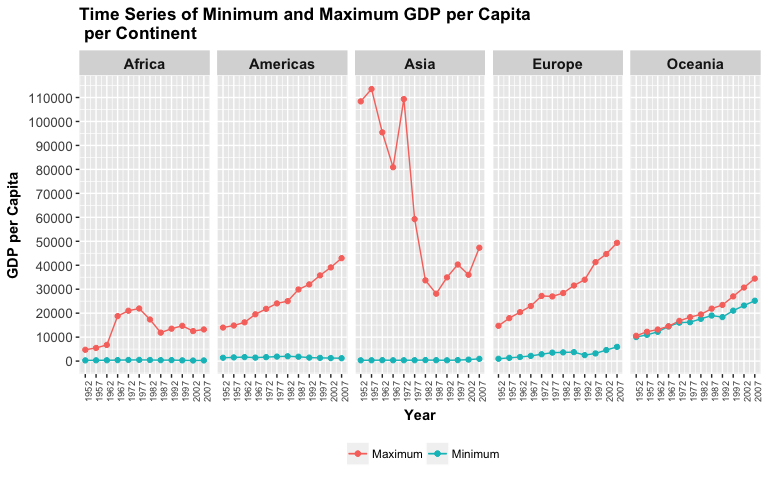
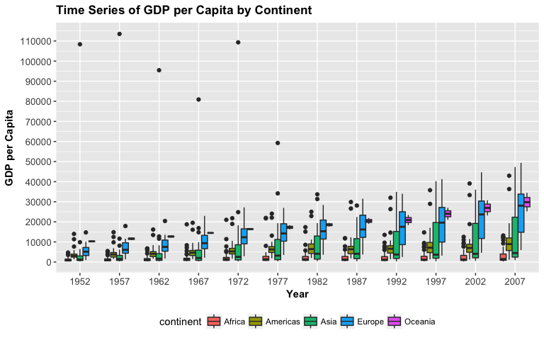
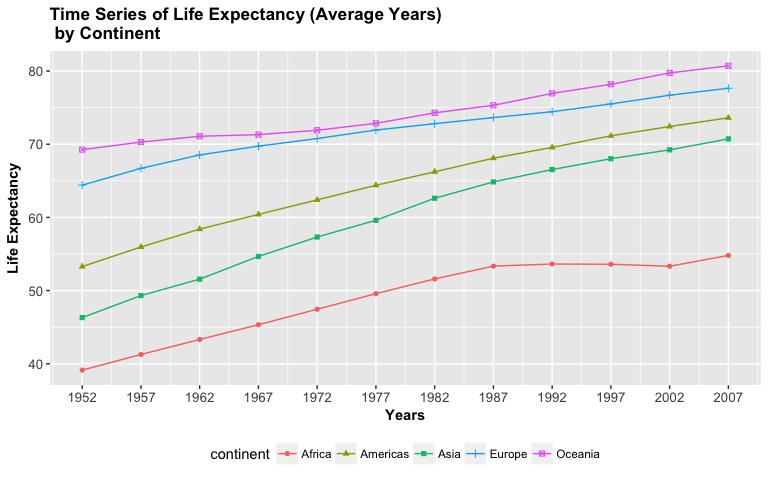
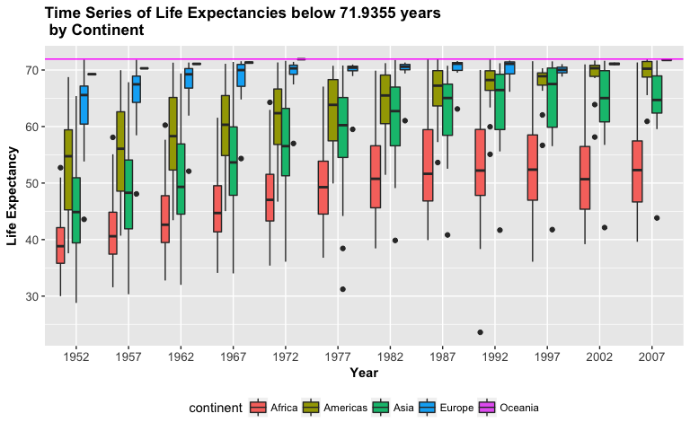

HW3- Use `dplyr` to manipulate and explore data (also use `ggplot2`)
================
Alexi Rodriguez-Arelis
03/10/2017

Loading Libraries
-----------------

First of all, we need to load the corresponding libraries.

``` r
suppressPackageStartupMessages(library(tidyverse))
suppressPackageStartupMessages(library(gapminder))
knitr::opts_chunk$set(fig.width = 8, fig.height = 5)
```

Tasks
-----

### *1. Get the maximum and minimum of GDP per capita for all continents.*

The task doesn't specify whether they should be a global maximum and minimum GDP per capita (timeless) or not. Thus, I'll plot a time series with the maximum and minimum per continent in order to check out how the gap evolves in each continent over time.

I need to create a grouped table by `continent` **and** `year` with `group_by()`, along with `summarize()` using functions `min()` and `max()`:

``` r
task_1_table <- gapminder %>%
  group_by(continent, year) %>% 
  summarize(Minimum = min(gdpPercap), Maximum = max(gdpPercap))
```

This produces the following table:

``` r
knitr::kable(task_1_table)
```

| continent |  year|     Minimum|     Maximum|
|:----------|-----:|-----------:|-----------:|
| Africa    |  1952|    298.8462|    4725.296|
| Africa    |  1957|    335.9971|    5487.104|
| Africa    |  1962|    355.2032|    6757.031|
| Africa    |  1967|    412.9775|   18772.752|
| Africa    |  1972|    464.0995|   21011.497|
| Africa    |  1977|    502.3197|   21951.212|
| Africa    |  1982|    462.2114|   17364.275|
| Africa    |  1987|    389.8762|   11864.408|
| Africa    |  1992|    410.8968|   13522.158|
| Africa    |  1997|    312.1884|   14722.842|
| Africa    |  2002|    241.1659|   12521.714|
| Africa    |  2007|    277.5519|   13206.485|
| Americas  |  1952|   1397.7171|   13990.482|
| Americas  |  1957|   1544.4030|   14847.127|
| Americas  |  1962|   1662.1374|   16173.146|
| Americas  |  1967|   1452.0577|   19530.366|
| Americas  |  1972|   1654.4569|   21806.036|
| Americas  |  1977|   1874.2989|   24072.632|
| Americas  |  1982|   2011.1595|   25009.559|
| Americas  |  1987|   1823.0160|   29884.350|
| Americas  |  1992|   1456.3095|   32003.932|
| Americas  |  1997|   1341.7269|   35767.433|
| Americas  |  2002|   1270.3649|   39097.100|
| Americas  |  2007|   1201.6372|   42951.653|
| Asia      |  1952|    331.0000|  108382.353|
| Asia      |  1957|    350.0000|  113523.133|
| Asia      |  1962|    388.0000|   95458.112|
| Asia      |  1967|    349.0000|   80894.883|
| Asia      |  1972|    357.0000|  109347.867|
| Asia      |  1977|    371.0000|   59265.477|
| Asia      |  1982|    424.0000|   33693.175|
| Asia      |  1987|    385.0000|   28118.430|
| Asia      |  1992|    347.0000|   34932.920|
| Asia      |  1997|    415.0000|   40300.620|
| Asia      |  2002|    611.0000|   36023.105|
| Asia      |  2007|    944.0000|   47306.990|
| Europe    |  1952|    973.5332|   14734.233|
| Europe    |  1957|   1353.9892|   17909.490|
| Europe    |  1962|   1709.6837|   20431.093|
| Europe    |  1967|   2172.3524|   22966.144|
| Europe    |  1972|   2860.1698|   27195.113|
| Europe    |  1977|   3528.4813|   26982.291|
| Europe    |  1982|   3630.8807|   28397.715|
| Europe    |  1987|   3738.9327|   31540.975|
| Europe    |  1992|   2497.4379|   33965.661|
| Europe    |  1997|   3193.0546|   41283.164|
| Europe    |  2002|   4604.2117|   44683.975|
| Europe    |  2007|   5937.0295|   49357.190|
| Oceania   |  1952|  10039.5956|   10556.576|
| Oceania   |  1957|  10949.6496|   12247.395|
| Oceania   |  1962|  12217.2269|   13175.678|
| Oceania   |  1967|  14463.9189|   14526.125|
| Oceania   |  1972|  16046.0373|   16788.629|
| Oceania   |  1977|  16233.7177|   18334.198|
| Oceania   |  1982|  17632.4104|   19477.009|
| Oceania   |  1987|  19007.1913|   21888.889|
| Oceania   |  1992|  18363.3249|   23424.767|
| Oceania   |  1997|  21050.4138|   26997.937|
| Oceania   |  2002|  23189.8014|   30687.755|
| Oceania   |  2007|  25185.0091|   34435.367|

Using `task_1_table`, we can plot the `Minimum` and `Maximum` in a time series:

``` r
task_1_plot <- ggplot(task_1_table, aes(x = year)) +
  xlab ("Year") + ylab("GDP per Capita") + 
  scale_x_continuous(breaks = seq(min(task_1_table$year), max(task_1_table$year), 5)) +
  ggtitle("Time Series for Minimum and Maximum GDP per Capita\n per Continent") +
  geom_line(aes(y = Minimum, colour = "Minimum")) +
  geom_line(aes(y = Maximum, colour = "Maximum")) +
  geom_point(aes(y = Minimum, colour = "Minimum")) + 
  geom_point(aes(y = Maximum, colour = "Maximum")) +
  theme(legend.position = "bottom") + 
  facet_grid(~ continent) +
  theme(axis.text.x = element_text(size = 7, angle = 90),
        axis.text.y = element_text(size = 10),
        axis.title = element_text(size = 11, face = "bold"),
        plot.title = element_text(size = 13, face = "bold"),
        strip.text.x = element_text(size = 11, face = "bold")) +
  theme(legend.title = element_blank()) +
  scale_y_continuous(breaks = seq(0, max(gapminder$gdpPercap), 10000)) 

task_1_plot
```



Before analizing the plot, note the following:

``` r
knitr::kable(gapminder %>% group_by(continent) %>% summarize(Number = n_distinct(country)))
```

| continent |  Number|
|:----------|-------:|
| Africa    |      52|
| Americas  |      25|
| Asia      |      33|
| Europe    |      30|
| Oceania   |       2|

Oceania has 2 countries in the dataset, and its `gdpPercap` gap is narrow over the years even though it gets wider at the end of the series. This suggests that inequality between these two countries is not that serious. However, when it comes to the Americas and Europe, inequality gets larger over time which is concerning. In terms of Africa, we can see that the gap is not large but the figures for the maximum are pretty small when compared to other continents.

When it comes to the maximum `gdpPercap`, the upward trend in the Americas, Europe and Oceania follows a logical pattern over time. However, why does Asia present such abnormal behaviour? Is it a certain country responsible of this situation? Our subset `task_1_table` doesn't contain the country with the maximum `gdpPercap`. Hence, we can get it by creating the following subset from `gapminder`:

``` r
task_1_table_Asia <- filter(gapminder, continent == "Asia") %>%
  select(year, country, gdpPercap) %>%
  group_by(year) %>% 
  filter(gdpPercap == max(gdpPercap)) %>%
  arrange(year)
knitr::kable(task_1_table_Asia)
```

|  year| country      |  gdpPercap|
|-----:|:-------------|----------:|
|  1952| Kuwait       |  108382.35|
|  1957| Kuwait       |  113523.13|
|  1962| Kuwait       |   95458.11|
|  1967| Kuwait       |   80894.88|
|  1972| Kuwait       |  109347.87|
|  1977| Kuwait       |   59265.48|
|  1982| Saudi Arabia |   33693.18|
|  1987| Kuwait       |   28118.43|
|  1992| Kuwait       |   34932.92|
|  1997| Kuwait       |   40300.62|
|  2002| Singapore    |   36023.11|
|  2007| Kuwait       |   47306.99|

Note that the countries presenting these unusual values for `gdpPercap` are Kuwait (1952-1977, 1987-1997, and 2007) as well as Saudi Arabia (1982). I'm pretty sure this is oil-related, but we will need further data in order to confirm this.

### *2. Look at the spread of GDP per capita within the continents.*

In order to do this, we can start out by extracting the corresponding information from `gapminder`:

``` r
task_2_table <- select(gapminder, continent, country, year, gdpPercap)
knitr::kable(task_2_table[1:20,])
```

| continent | country     |  year|  gdpPercap|
|:----------|:------------|-----:|----------:|
| Asia      | Afghanistan |  1952|   779.4453|
| Asia      | Afghanistan |  1957|   820.8530|
| Asia      | Afghanistan |  1962|   853.1007|
| Asia      | Afghanistan |  1967|   836.1971|
| Asia      | Afghanistan |  1972|   739.9811|
| Asia      | Afghanistan |  1977|   786.1134|
| Asia      | Afghanistan |  1982|   978.0114|
| Asia      | Afghanistan |  1987|   852.3959|
| Asia      | Afghanistan |  1992|   649.3414|
| Asia      | Afghanistan |  1997|   635.3414|
| Asia      | Afghanistan |  2002|   726.7341|
| Asia      | Afghanistan |  2007|   974.5803|
| Europe    | Albania     |  1952|  1601.0561|
| Europe    | Albania     |  1957|  1942.2842|
| Europe    | Albania     |  1962|  2312.8890|
| Europe    | Albania     |  1967|  2760.1969|
| Europe    | Albania     |  1972|  3313.4222|
| Europe    | Albania     |  1977|  3533.0039|
| Europe    | Albania     |  1982|  3630.8807|
| Europe    | Albania     |  1987|  3738.9327|

I'm just displaying the first 20 rows of `task_2_table` since I'm selecting `continent`, `country`, `year`, and `gdpPercap` from the 1704 records in `gapminder`. Again, I'm interested in a time series per `continent`, so I'll create side-by-side boxplots in order to compare the spread in the data.

``` r
task_2_plot <-  ggplot(task_2_table, aes(x = as.factor(year), y = gdpPercap)) + 
  xlab ("Year") + ylab("GDP per Capita") + 
  ggtitle("Time Series of GDP per Capita by Continent") +
  geom_boxplot(aes(fill = continent)) +
  theme(legend.position = "bottom") + 
  theme(axis.text.x = element_text(size = 10),
        axis.text.y = element_text(size = 10),
        axis.title = element_text(size = 11, face = "bold"),
        plot.title = element_text(size = 13, face = "bold")) + 
  scale_y_continuous(breaks = seq(0, max(gapminder$gdpPercap), 10000))

task_2_plot
```



In terms of Africa, even though it has really small values compared to other continents, the spread doesn't grow too much over time. On the other hand, continents like Asia and Europe, present evident disparities that grow significantly over time (note the particular outliers in the Asian countries from 1952 to 1977). The Americas has a poor evolution on this metric but the spread doesn't grow too much over time.

### *3. How is life expectancy changing over time on different continents?*

We can make a similar plot, as in 2, but with means in `lifeExp` over time per continent. Thus, we need to create a new table by `continent` and `year`:

``` r
task_3_table <- gapminder %>%
  group_by(continent, year) %>% 
  summarize(Mean_lifeExp = mean(lifeExp))
knitr::kable(task_3_table)
```

| continent |  year|  Mean\_lifeExp|
|:----------|-----:|--------------:|
| Africa    |  1952|       39.13550|
| Africa    |  1957|       41.26635|
| Africa    |  1962|       43.31944|
| Africa    |  1967|       45.33454|
| Africa    |  1972|       47.45094|
| Africa    |  1977|       49.58042|
| Africa    |  1982|       51.59287|
| Africa    |  1987|       53.34479|
| Africa    |  1992|       53.62958|
| Africa    |  1997|       53.59827|
| Africa    |  2002|       53.32523|
| Africa    |  2007|       54.80604|
| Americas  |  1952|       53.27984|
| Americas  |  1957|       55.96028|
| Americas  |  1962|       58.39876|
| Americas  |  1967|       60.41092|
| Americas  |  1972|       62.39492|
| Americas  |  1977|       64.39156|
| Americas  |  1982|       66.22884|
| Americas  |  1987|       68.09072|
| Americas  |  1992|       69.56836|
| Americas  |  1997|       71.15048|
| Americas  |  2002|       72.42204|
| Americas  |  2007|       73.60812|
| Asia      |  1952|       46.31439|
| Asia      |  1957|       49.31854|
| Asia      |  1962|       51.56322|
| Asia      |  1967|       54.66364|
| Asia      |  1972|       57.31927|
| Asia      |  1977|       59.61056|
| Asia      |  1982|       62.61794|
| Asia      |  1987|       64.85118|
| Asia      |  1992|       66.53721|
| Asia      |  1997|       68.02052|
| Asia      |  2002|       69.23388|
| Asia      |  2007|       70.72848|
| Europe    |  1952|       64.40850|
| Europe    |  1957|       66.70307|
| Europe    |  1962|       68.53923|
| Europe    |  1967|       69.73760|
| Europe    |  1972|       70.77503|
| Europe    |  1977|       71.93777|
| Europe    |  1982|       72.80640|
| Europe    |  1987|       73.64217|
| Europe    |  1992|       74.44010|
| Europe    |  1997|       75.50517|
| Europe    |  2002|       76.70060|
| Europe    |  2007|       77.64860|
| Oceania   |  1952|       69.25500|
| Oceania   |  1957|       70.29500|
| Oceania   |  1962|       71.08500|
| Oceania   |  1967|       71.31000|
| Oceania   |  1972|       71.91000|
| Oceania   |  1977|       72.85500|
| Oceania   |  1982|       74.29000|
| Oceania   |  1987|       75.32000|
| Oceania   |  1992|       76.94500|
| Oceania   |  1997|       78.19000|
| Oceania   |  2002|       79.74000|
| Oceania   |  2007|       80.71950|

As in 1, we could opt for facetting by `continent`, but it would be nicer to plot all the time series on the same plane as follows:

``` r
task_3_plot <- ggplot(task_3_table, aes(x = year, y = Mean_lifeExp)) +
  xlab ("Years") + ylab("Life Expectancy") + 
  scale_x_continuous(breaks = seq(min(task_3_table$year), max(task_3_table$year), 5)) +
  ggtitle("Time Series of Life Expectancy (Average Years)\n by Continent") +
  geom_point(aes(colour = continent, shape = continent)) +
  geom_line(aes(group = continent, colour = continent)) +
  theme(legend.position = "bottom") + 
  theme(axis.text.x = element_text(size = 10),
        axis.text.y = element_text(size = 10),
        axis.title = element_text(size = 11, face = "bold"),
        plot.title = element_text(size = 13, face = "bold"),
        strip.text.x = element_text(size = 11, face = "bold")) +
  labs(shape = "continent", colour = "continent") 

task_3_plot
```



We don't need to modify the scale of the y-axis in this plot since `ggplot2()` automatically adapts it to our current range of values (pretty convenient!). The evolution of the African life expectancy over time seems promising from 1952 to 1987, but it stops its upward trend beginning 1987 (there must be a reason why this is happening, and we will need further data in order to find it out). Note the significant gap in 2007 between Africa (a rough average of 55 years) versus Oceania with its two countries (a rough average close to 80 years). We can say that the other three continents in 2007 (Europe, the Americas and Asia) have acceptable average life expectancies above 70 years in that same year.

### *4. Report the absolute and/or relative abundance of countries with low life expectancy over time by continent: Compute some measure of worldwide life expectancy – you decide – a mean or median or some other quantile or perhaps your current age. Then determine how many countries on each continent have a life expectancy less than this benchmark, for each year.*

I will choose the worldwide median in `lifeExp` as a threshold. But, since `gapminder` has different data points over time for each country, I will get the worldwide median corresponding to `year` 2007. I'm not choosing the mean value since this metric is sensitive to outliers unlike the median:

``` r
# Getting worldwide median in 2007
median_lifeExp_2007 <- median(filter(gapminder, year == 2007)$lifeExp)
print(median_lifeExp_2007)
```

    ## [1] 71.9355

This value of 71.9355 years will be the threshold for getting those countries that fall below over time. Therefore, we will create the following subset:

``` r
task_4_table <- task_2_table <- select(gapminder, continent, country, year, lifeExp) %>%
  filter(lifeExp < median_lifeExp_2007)
print(dim(task_4_table))
```

    ## [1] 1355    4

The subset `task_4_table` contains 1355 `country` records that fall below `median_lifeExp_2007`, from different years and continents as follows:

``` r
knitr::kable(task_4_table[1:20,])
```

| continent | country     |  year|  lifeExp|
|:----------|:------------|-----:|--------:|
| Asia      | Afghanistan |  1952|   28.801|
| Asia      | Afghanistan |  1957|   30.332|
| Asia      | Afghanistan |  1962|   31.997|
| Asia      | Afghanistan |  1967|   34.020|
| Asia      | Afghanistan |  1972|   36.088|
| Asia      | Afghanistan |  1977|   38.438|
| Asia      | Afghanistan |  1982|   39.854|
| Asia      | Afghanistan |  1987|   40.822|
| Asia      | Afghanistan |  1992|   41.674|
| Asia      | Afghanistan |  1997|   41.763|
| Asia      | Afghanistan |  2002|   42.129|
| Asia      | Afghanistan |  2007|   43.828|
| Europe    | Albania     |  1952|   55.230|
| Europe    | Albania     |  1957|   59.280|
| Europe    | Albania     |  1962|   64.820|
| Europe    | Albania     |  1967|   66.220|
| Europe    | Albania     |  1972|   67.690|
| Europe    | Albania     |  1977|   68.930|
| Europe    | Albania     |  1982|   70.420|
| Europe    | Albania     |  1992|   71.581|

The previous table only shows the first 20 rows of subset `task_4_table`. We can get summary tables that count down the number of countries by `year` and `continent` in the following way with column `Number`:

``` r
task_4_table_country_freq <- task_4_table %>% 
  group_by(year, continent) %>% 
  summarize(Number = n_distinct(country)) %>%
  mutate(Percentage = round(Number / sum(Number) * 100, digits = 1)) %>%
  arrange(year, desc(Percentage))
knitr::kable(task_4_table_country_freq)
```

|  year| continent |  Number|  Percentage|
|-----:|:----------|-------:|-----------:|
|  1952| Africa    |      52|        37.4|
|  1952| Asia      |      33|        23.7|
|  1952| Europe    |      27|        19.4|
|  1952| Americas  |      25|        18.0|
|  1952| Oceania   |       2|         1.4|
|  1957| Africa    |      52|        37.7|
|  1957| Asia      |      33|        23.9|
|  1957| Europe    |      26|        18.8|
|  1957| Americas  |      25|        18.1|
|  1957| Oceania   |       2|         1.4|
|  1962| Africa    |      52|        38.0|
|  1962| Asia      |      33|        24.1|
|  1962| Americas  |      25|        18.2|
|  1962| Europe    |      25|        18.2|
|  1962| Oceania   |       2|         1.5|
|  1967| Africa    |      52|        38.5|
|  1967| Asia      |      33|        24.4|
|  1967| Americas  |      24|        17.8|
|  1967| Europe    |      24|        17.8|
|  1967| Oceania   |       2|         1.5|
|  1972| Africa    |      52|        40.9|
|  1972| Asia      |      31|        24.4|
|  1972| Americas  |      23|        18.1|
|  1972| Europe    |      19|        15.0|
|  1972| Oceania   |       2|         1.6|
|  1977| Africa    |      52|        44.8|
|  1977| Asia      |      30|        25.9|
|  1977| Americas  |      21|        18.1|
|  1977| Europe    |      13|        11.2|
|  1982| Africa    |      52|        46.0|
|  1982| Asia      |      29|        25.7|
|  1982| Americas  |      20|        17.7|
|  1982| Europe    |      12|        10.6|
|  1987| Africa    |      52|        48.1|
|  1987| Asia      |      27|        25.0|
|  1987| Americas  |      19|        17.6|
|  1987| Europe    |      10|         9.3|
|  1992| Africa    |      51|        50.5|
|  1992| Asia      |      25|        24.8|
|  1992| Americas  |      17|        16.8|
|  1992| Europe    |       8|         7.9|
|  1997| Africa    |      50|        56.2|
|  1997| Asia      |      23|        25.8|
|  1997| Americas  |      12|        13.5|
|  1997| Europe    |       4|         4.5|
|  2002| Africa    |      48|        59.3|
|  2002| Asia      |      19|        23.5|
|  2002| Americas  |      12|        14.8|
|  2002| Europe    |       2|         2.5|
|  2007| Africa    |      47|        66.2|
|  2007| Asia      |      15|        21.1|
|  2007| Americas  |       8|        11.3|
|  2007| Europe    |       1|         1.4|

Our previous table arranges the single occcurrences by `year` in ascending order, where `continent` is nested in descending order. Furthermore, column `Percentage` depicts the percentage of countries that each `continent` has per `year` in a descending order. The information contained in this table is not easy to read since we have a significant number of rows. However, roughly speaking, Africa and Asia always have the highest percentages of countries every year. A stacked bar chart of these percetages per `year` and `continent` will be more illustrative, using `task_4_table_country_freq`:

``` r
# Changing the order in continent levels
task_4_table_country_freq$continent <- factor(task_4_table_country_freq$continent,
                                              levels = c("Africa", "Asia", "Americas", "Europe", "Oceania"))

task_4_plot <- ggplot(task_4_table_country_freq, aes(x = as.factor(year), y = Percentage, fill = continent)) + 
  geom_bar(stat = 'identity') +
  coord_flip() +
  theme(legend.position = "bottom") +
  ggtitle("Time Series for Proportion of Countries below Life Expectancy Median of 2007\n by Continent") +
  theme(legend.position = "bottom") + 
  theme(axis.text.x = element_text(size = 10),
        axis.text.y = element_text(size = 10),
        axis.title = element_text(size = 11, face = "bold"),
        plot.title = element_text(size = 12, face = "bold")) +
  xlab("Year") +
  guides(fill = guide_legend(reverse = TRUE))

task_4_plot
```


Note we flipped the axis with `coord_flip()`, and reversed the labels in the legend with `guides(fill = guide_legend(reverse = TRUE))`. The plot shows us that Africa has been increasing its number of countries that are below the life expectancy of 71.9355 years over the years, unlike the rest of the continents. But now, how are all these life expectancies behaving over time? What is their respective spread by continent? We can make side-by-side plots with `task_4_table`:

``` r
task_4_plot_2 <- ggplot(task_4_table, aes(x = as.factor(year), y = lifeExp)) + 
  geom_boxplot(aes(fill = continent)) +
  xlab ("Year") + ylab("Life Expectancy") + ggtitle("Time Series of Life Expectancies below 71.9355 years\n by Continent") + 
  theme(legend.position = "bottom") + 
  theme(axis.text.x = element_text(size = 10),
        axis.text.y = element_text(size = 10),
        axis.title = element_text(size = 11, face = "bold"),
        plot.title = element_text(size = 13, face = "bold")) +
  geom_hline(yintercept = median_lifeExp_2007, color = "magenta")

task_4_plot_2
```



The magenta line indicates the threshold of 71.9355 years. We can see that the gap in European medians gets narrower over the years until 2007, as well as in the Americas. This narrowing trend is followed by Asia and Africa during the first years until 1997. Note that the values for the African counties are really below the threshold, even in 2007, which is concerning.
