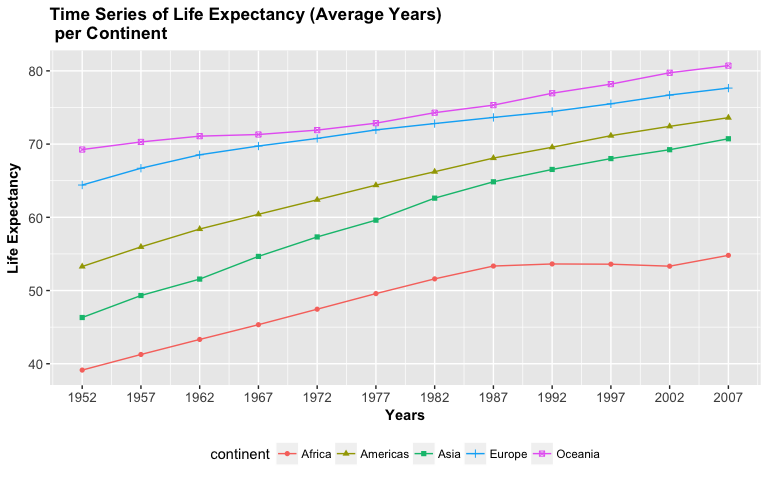
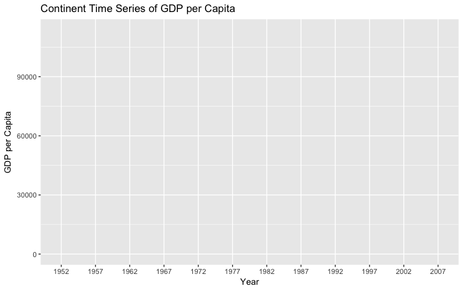
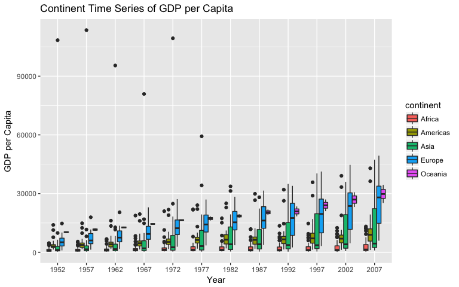
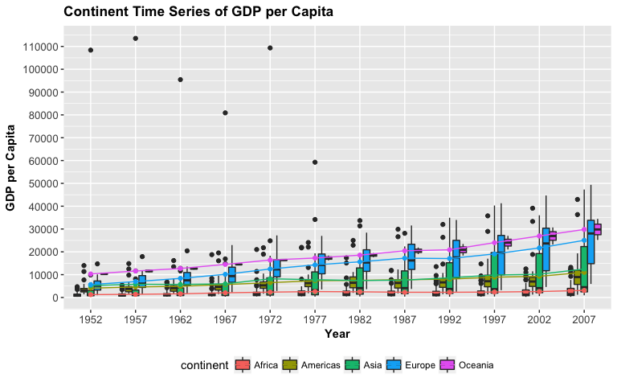
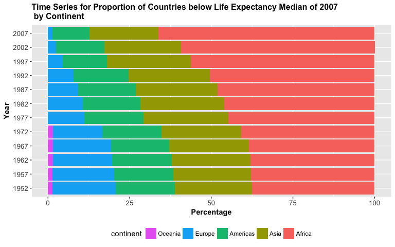
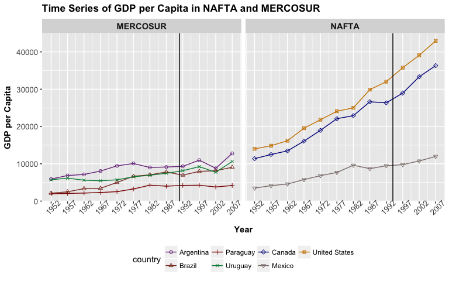

HW3- Use `dplyr` to manipulate and explore data (also use `ggplot2`)
================
Alexi Rodriguez-Arelis
29/9/2017

Loading Libraries
-----------------

First of all, we need to load the corresponding libraries.

``` r
suppressPackageStartupMessages(library(tidyverse))
suppressPackageStartupMessages(library(gapminder))
knitr::opts_chunk$set(fig.width=8, fig.height=5)
```

Smell Test the Data
-------------------

Now, we proceed with the primary dataset exploration.

*1. Is it a data.frame, a matrix, a vector, a list?*

``` r
typeof(gapminder)
```

    ## [1] "list"

Using function `typeof()`, we can see that `gapminder` is a `list`.

*2. What’s its class?*

``` r
class(gapminder)
```

    ## [1] "tbl_df"     "tbl"        "data.frame"

Function `class()` tells us that `gapminder` is a `tibble`, a class of `data.frame`.

*3. How many variables/columns?*

``` r
ncol(gapminder)
```

    ## [1] 6

With `ncol()` we can get the number of columns or variables, 6.

*4. How many rows/observations?*

``` r
nrow(gapminder)
```

    ## [1] 1704

With `nrow()` we can get the number of rows or observations, 1704.

*5. Can you get these facts about “extent” or “size” in more than one way? Can you imagine different functions being useful in different contexts?*

``` r
dim(gapminder)
```

    ## [1] 1704    6

Function `dim` provides the number of rows and columns on a single vector.

*6. What data type is each variable?*

``` r
str(gapminder)
```

    ## Classes 'tbl_df', 'tbl' and 'data.frame':    1704 obs. of  6 variables:
    ##  $ country  : Factor w/ 142 levels "Afghanistan",..: 1 1 1 1 1 1 1 1 1 1 ...
    ##  $ continent: Factor w/ 5 levels "Africa","Americas",..: 3 3 3 3 3 3 3 3 3 3 ...
    ##  $ year     : int  1952 1957 1962 1967 1972 1977 1982 1987 1992 1997 ...
    ##  $ lifeExp  : num  28.8 30.3 32 34 36.1 ...
    ##  $ pop      : int  8425333 9240934 10267083 11537966 13079460 14880372 12881816 13867957 16317921 22227415 ...
    ##  $ gdpPercap: num  779 821 853 836 740 ...

The 6 variables are described as follows:

-   `country`: A factor with 142 levels (all countries in `gapminder`).
-   `continent`: A factor with 5 levels (continents of the world, except Antarctica).
-   `year`: A factor providing the years of the respective figures.
-   `lifeExp`: A decimal value in years of life expectancy per `country` and `year`.
-   `pop`: An integer value of the population per `country` and `year`.
-   `gdpPercap`: A decimal value of the gross domestic product per capita, per `country` and `year`.

Explore Individual Variables
----------------------------

In terms of the quantitative variable, we pick `gdpPercap`.

``` r
summary(gapminder$gdpPercap)
```

    ##     Min.  1st Qu.   Median     Mean  3rd Qu.     Max. 
    ##    241.2   1202.1   3531.8   7215.3   9325.5 113523.1

Function `summary()` provides the range of this quantitative variable, as well as the respective measures of spread. If we want to plot the corresponding information in a suitable way, we could use side-by-side boxplots. Furthermore, we can also take into account the variable `year` in order to track the evolution over time. Note that we aren't providing a detailed analysis (yet!).

``` r
boxplot(gdpPercap ~ year, data = gapminder, main = "Global Evolution of Gross Domestic Product over Time \n", xlab = "Year", ylab = "Gross Domestic Product per Capita")
```



Function `boxplot()` provides "not so cool" side-by-side boxplots, unlike `ggplot2`. Although, we can see that the spread gets larger and larger as time goes by. This suggests that there might be differences in `gdpPercap`, if we explore the dataset more in detail (possibly by `continent`?). Hence, before starting with the good stuff (`ggplot2`), we can get a table of the categorical variable `continent` for single occurrences.

``` r
gapminder %>% group_by(continent) %>% summarize(n = n_distinct(country))
```

    ## # A tibble: 5 x 2
    ##   continent     n
    ##      <fctr> <int>
    ## 1    Africa    52
    ## 2  Americas    25
    ## 3      Asia    33
    ## 4    Europe    30
    ## 5   Oceania     2

Note that the number of countries per `continent` is highly variable, which might require a further plotting analysis in `gdpPercap`.

Explore Various Plot Types
--------------------------

`ggplot2` offers useful plotting tools that allow us to get a better sense on how our dataset is behaving. Variable `gdpPercap` can be plotted in different ways, while subsetting our data with `dplyr`. We can start out with a time series depicting side-by-side boxplots per continent (since we already plotted a global time series in the previous section), as well as the corresponding annual means in the form of lines with points per year.

``` r
time.gdp.continent <- ggplot(gapminder, aes(x = as.factor(year), y = gdpPercap)) + xlab ("Year") + ylab("GDP per Capita") + ggtitle("Continent Time Series of GDP per Capita")
time.gdp.continent
```



The first layer doesn't containt any plots yet, it only sets up the plotting field. Now, we will add the side-by-side continent boxplots on a yearly time series. Note we're using `as.factor(year)` in order to change this integer variable into a factor.

``` r
time.gdp.continent <- time.gdp.continent + geom_boxplot(aes(fill = continent))
time.gdp.continent
```



The aesthetics don't seem entirely appropriate. Thus, we will use the following code to fix up the axes, titles and legend:

``` r
time.gdp.continent <- time.gdp.continent + theme(legend.position = "bottom") + 
  theme(axis.text.x = element_text(size = 10),
        axis.text.y = element_text(size = 10),
        axis.title = element_text(size = 11, face = "bold"),
        plot.title = element_text(size = 13, face = "bold")) + 
  scale_y_continuous(breaks = seq(0, max(gapminder$gdpPercap), 10000)) 
time.gdp.continent
```


Now, we add annual means in the form of lines with points per year with `stat_summary()`:

``` r
time.gdp.continent <- time.gdp.continent + stat_summary(fun.y = mean, geom = "line", aes(group = continent, colour = continent)) + 
  stat_summary(fun.y = mean, geom = "point",  aes(group = continent, colour = continent))
time.gdp.continent
```



We still need to fix up the legends and colours with the following code:

``` r
boxplot_colors <- c("mediumorchid1", "coral2", "firebrick1", "springgreen", "cornflowerblue")
line_colors <- c("mediumorchid4", "coral4", "red4", "springgreen4", "darkblue")
time.gdp.continent <- time.gdp.continent + labs(shape = "continent", colour = "continent") + 
   scale_fill_manual(values = boxplot_colors) + scale_color_manual(values = line_colors)
time.gdp.continent
```



Finally, the plot looks nice and shows us that the continent with the lowest GDP's per capita over time is Africa, despite it's composed of 52 countries. Compared to the 30 European countries, and their higher values, the differences are concerning.

With the use of `dplyr`, we can go further by focusing our analysis on a single continent. Let's use the information related to the Americas, and create a subset called `Americas`.

``` r
Americas <- filter(gapminder, continent == "Americas")
Americas
```

    ## # A tibble: 300 x 6
    ##      country continent  year lifeExp      pop gdpPercap
    ##       <fctr>    <fctr> <int>   <dbl>    <int>     <dbl>
    ##  1 Argentina  Americas  1952  62.485 17876956  5911.315
    ##  2 Argentina  Americas  1957  64.399 19610538  6856.856
    ##  3 Argentina  Americas  1962  65.142 21283783  7133.166
    ##  4 Argentina  Americas  1967  65.634 22934225  8052.953
    ##  5 Argentina  Americas  1972  67.065 24779799  9443.039
    ##  6 Argentina  Americas  1977  68.481 26983828 10079.027
    ##  7 Argentina  Americas  1982  69.942 29341374  8997.897
    ##  8 Argentina  Americas  1987  70.774 31620918  9139.671
    ##  9 Argentina  Americas  1992  71.868 33958947  9308.419
    ## 10 Argentina  Americas  1997  73.275 36203463 10967.282
    ## # ... with 290 more rows

What if we're interested in the evolution of the `gdpPercap` of countries involved in certain trade agreements in the Americas? For instance, what has been the `gdpPercap` evolution before and after **NAFTA** and **MERCOSUR** for their country members?

In the case of **NAFTA**, the agreement came into force in 1994 and the founding countries are the United States, Canada, and Mexico. For **MERCOSUR**, the agreement came into force in 1991 and the founding countries are Argentina, Brazil, Paraguay, and Uruguay.

From the dataset `Americas`, we're going to extract those 7 countries in a new dataset called `trade.agreements` and select the `country`, `year`, and `gdpPercap` columns:

``` r
trade.agreements <- Americas %>% 
  filter(country %in% c("United States", "Canada", "Mexico", 
                          "Argentina", "Brazil", "Paraguay", "Uruguay")) %>%
  select(country, year, gdpPercap)
trade.agreements 
```

    ## # A tibble: 84 x 3
    ##      country  year gdpPercap
    ##       <fctr> <int>     <dbl>
    ##  1 Argentina  1952  5911.315
    ##  2 Argentina  1957  6856.856
    ##  3 Argentina  1962  7133.166
    ##  4 Argentina  1967  8052.953
    ##  5 Argentina  1972  9443.039
    ##  6 Argentina  1977 10079.027
    ##  7 Argentina  1982  8997.897
    ##  8 Argentina  1987  9139.671
    ##  9 Argentina  1992  9308.419
    ## 10 Argentina  1997 10967.282
    ## # ... with 74 more rows

Now, we have to create additional column indicating what trade agreement the country belongs to (`Agreement`):

``` r
trade.agreements <- trade.agreements %>% 
  mutate(Agreement = if_else(country %in% c("United States", "Canada", "Mexico"), "NAFTA", "MERCOSUR"))
trade.agreements
```

    ## # A tibble: 84 x 4
    ##      country  year gdpPercap Agreement
    ##       <fctr> <int>     <dbl>     <chr>
    ##  1 Argentina  1952  5911.315  MERCOSUR
    ##  2 Argentina  1957  6856.856  MERCOSUR
    ##  3 Argentina  1962  7133.166  MERCOSUR
    ##  4 Argentina  1967  8052.953  MERCOSUR
    ##  5 Argentina  1972  9443.039  MERCOSUR
    ##  6 Argentina  1977 10079.027  MERCOSUR
    ##  7 Argentina  1982  8997.897  MERCOSUR
    ##  8 Argentina  1987  9139.671  MERCOSUR
    ##  9 Argentina  1992  9308.419  MERCOSUR
    ## 10 Argentina  1997 10967.282  MERCOSUR
    ## # ... with 74 more rows

We need to reorder the factor levels for `country`, so the plot will be more understanble in terms of the legend.

``` r
# Checking current level order
levels(trade.agreements$country) 
```

    ##   [1] "Afghanistan"              "Albania"                 
    ##   [3] "Algeria"                  "Angola"                  
    ##   [5] "Argentina"                "Australia"               
    ##   [7] "Austria"                  "Bahrain"                 
    ##   [9] "Bangladesh"               "Belgium"                 
    ##  [11] "Benin"                    "Bolivia"                 
    ##  [13] "Bosnia and Herzegovina"   "Botswana"                
    ##  [15] "Brazil"                   "Bulgaria"                
    ##  [17] "Burkina Faso"             "Burundi"                 
    ##  [19] "Cambodia"                 "Cameroon"                
    ##  [21] "Canada"                   "Central African Republic"
    ##  [23] "Chad"                     "Chile"                   
    ##  [25] "China"                    "Colombia"                
    ##  [27] "Comoros"                  "Congo, Dem. Rep."        
    ##  [29] "Congo, Rep."              "Costa Rica"              
    ##  [31] "Cote d'Ivoire"            "Croatia"                 
    ##  [33] "Cuba"                     "Czech Republic"          
    ##  [35] "Denmark"                  "Djibouti"                
    ##  [37] "Dominican Republic"       "Ecuador"                 
    ##  [39] "Egypt"                    "El Salvador"             
    ##  [41] "Equatorial Guinea"        "Eritrea"                 
    ##  [43] "Ethiopia"                 "Finland"                 
    ##  [45] "France"                   "Gabon"                   
    ##  [47] "Gambia"                   "Germany"                 
    ##  [49] "Ghana"                    "Greece"                  
    ##  [51] "Guatemala"                "Guinea"                  
    ##  [53] "Guinea-Bissau"            "Haiti"                   
    ##  [55] "Honduras"                 "Hong Kong, China"        
    ##  [57] "Hungary"                  "Iceland"                 
    ##  [59] "India"                    "Indonesia"               
    ##  [61] "Iran"                     "Iraq"                    
    ##  [63] "Ireland"                  "Israel"                  
    ##  [65] "Italy"                    "Jamaica"                 
    ##  [67] "Japan"                    "Jordan"                  
    ##  [69] "Kenya"                    "Korea, Dem. Rep."        
    ##  [71] "Korea, Rep."              "Kuwait"                  
    ##  [73] "Lebanon"                  "Lesotho"                 
    ##  [75] "Liberia"                  "Libya"                   
    ##  [77] "Madagascar"               "Malawi"                  
    ##  [79] "Malaysia"                 "Mali"                    
    ##  [81] "Mauritania"               "Mauritius"               
    ##  [83] "Mexico"                   "Mongolia"                
    ##  [85] "Montenegro"               "Morocco"                 
    ##  [87] "Mozambique"               "Myanmar"                 
    ##  [89] "Namibia"                  "Nepal"                   
    ##  [91] "Netherlands"              "New Zealand"             
    ##  [93] "Nicaragua"                "Niger"                   
    ##  [95] "Nigeria"                  "Norway"                  
    ##  [97] "Oman"                     "Pakistan"                
    ##  [99] "Panama"                   "Paraguay"                
    ## [101] "Peru"                     "Philippines"             
    ## [103] "Poland"                   "Portugal"                
    ## [105] "Puerto Rico"              "Reunion"                 
    ## [107] "Romania"                  "Rwanda"                  
    ## [109] "Sao Tome and Principe"    "Saudi Arabia"            
    ## [111] "Senegal"                  "Serbia"                  
    ## [113] "Sierra Leone"             "Singapore"               
    ## [115] "Slovak Republic"          "Slovenia"                
    ## [117] "Somalia"                  "South Africa"            
    ## [119] "Spain"                    "Sri Lanka"               
    ## [121] "Sudan"                    "Swaziland"               
    ## [123] "Sweden"                   "Switzerland"             
    ## [125] "Syria"                    "Taiwan"                  
    ## [127] "Tanzania"                 "Thailand"                
    ## [129] "Togo"                     "Trinidad and Tobago"     
    ## [131] "Tunisia"                  "Turkey"                  
    ## [133] "Uganda"                   "United Kingdom"          
    ## [135] "United States"            "Uruguay"                 
    ## [137] "Venezuela"                "Vietnam"                 
    ## [139] "West Bank and Gaza"       "Yemen, Rep."             
    ## [141] "Zambia"                   "Zimbabwe"

We can see that `trade.agreements$country` still has the original factor levels from `gapminder$country`. So, we use the function `droplevels()` to get rid of those unused levels.

``` r
trade.agreements$country <- droplevels(trade.agreements$country)
levels(trade.agreements$country)
```

    ## [1] "Argentina"     "Brazil"        "Canada"        "Mexico"       
    ## [5] "Paraguay"      "United States" "Uruguay"

Now that we dropped the unused factor levels, we can set up a new level order. Firstly, the **MERCOSUR** group, and secondly, the **NAFTA** group. We use the function `factor()`.

``` r
trade.agreements$country <- factor(trade.agreements$country, 
                                   levels = c("Argentina", "Brazil", "Paraguay", "Uruguay",
                                              "Canada", "Mexico", "United States"))
levels(trade.agreements$country)
```

    ## [1] "Argentina"     "Brazil"        "Paraguay"      "Uruguay"      
    ## [5] "Canada"        "Mexico"        "United States"

Finally, the dataset `trade.agreements` can be used for plotting the corresponding time series. The plot can't be a boxplot since we only have a single observation per `year` and `country`. Thus, we're plotting lines with points. Note we're facetting by `Agreement`.

``` r
line_colors.2 <- c("mediumorchid4", "coral4", 
                   "red4", "springgreen4", 
                   "darkblue", "mistyrose4", "orange3")
time.gdp.continent <- ggplot(trade.agreements, aes(x = year, y = gdpPercap)) + 
  xlab ("Year") + 
  ylab("GDP per Capita") + 
  scale_x_continuous(breaks = seq(min(trade.agreements$year), max(trade.agreements$year), 5)) +
  facet_grid(~ Agreement) +
  ggtitle("Time Series of GDP per Capita in NAFTA and MERCOSUR") +
  geom_point(aes(colour = country, shape = country)) +
  geom_line(aes(group = country, colour = country)) +
  theme(legend.position = "bottom") + 
  theme(axis.text.x = element_text(size = 10, angle = 45),
        axis.text.y = element_text(size = 10),
        axis.title = element_text(size = 11, face = "bold"),
        plot.title = element_text(size = 13, face = "bold"),
        strip.text.x = element_text(size = 11, face = "bold")) + 
  labs(shape = "country", colour = "country") + scale_color_manual(values = line_colors.2) +
  scale_shape_manual(values = 1:length(line_colors.2))
time.gdp.continent
```


It seems that the plot is completely done. However, we can make it even nicer by adding vertical lines indicating the year where the trade agreements came into force (1991 for **MERCOSUR**, and 1994 for **NAFTA**). We need to create a dummy data frame called `dummy.df` that matches the respective `Agreement` levels.

``` r
dummy.df <- data.frame(Agreement = c("MERCOSUR", "NAFTA"), X = c(1991, 1994))
time.gdp.continent + geom_vline(data = dummy.df, aes(xintercept = X))
```



Note that both lines fall into the respective enforcement years. From this plot, after **NAFTA** was enforced, we can see that the largest impact on `gdpPercap` was on Canada and the United States unlike the rest of the Latin American countries. The difference is even more concerning for those countries that are part of **MERCOSUR**

But I want to do more!
----------------------

*Evaluate this code and describe the result. Presumably the analyst’s intent was to get the data for Rwanda and Afghanistan. Did they succeed? Why or why not? If not, what is the correct way to do this?*

``` r
filter(gapminder, country == c("Rwanda", "Afghanistan"))
```

    ## # A tibble: 12 x 6
    ##        country continent  year lifeExp      pop gdpPercap
    ##         <fctr>    <fctr> <int>   <dbl>    <int>     <dbl>
    ##  1 Afghanistan      Asia  1957  30.332  9240934  820.8530
    ##  2 Afghanistan      Asia  1967  34.020 11537966  836.1971
    ##  3 Afghanistan      Asia  1977  38.438 14880372  786.1134
    ##  4 Afghanistan      Asia  1987  40.822 13867957  852.3959
    ##  5 Afghanistan      Asia  1997  41.763 22227415  635.3414
    ##  6 Afghanistan      Asia  2007  43.828 31889923  974.5803
    ##  7      Rwanda    Africa  1952  40.000  2534927  493.3239
    ##  8      Rwanda    Africa  1962  43.000  3051242  597.4731
    ##  9      Rwanda    Africa  1972  44.600  3992121  590.5807
    ## 10      Rwanda    Africa  1982  46.218  5507565  881.5706
    ## 11      Rwanda    Africa  1992  23.599  7290203  737.0686
    ## 12      Rwanda    Africa  2002  43.413  7852401  785.6538

In the case of Afganistan, the analyst isn't getting all the records beginning 1952. The condition `country == c("Rwanda", "Afghanistan")` isn't correct for the analyst's purpose.

``` r
head(gapminder)
```

    ## # A tibble: 6 x 6
    ##       country continent  year lifeExp      pop gdpPercap
    ##        <fctr>    <fctr> <int>   <dbl>    <int>     <dbl>
    ## 1 Afghanistan      Asia  1952  28.801  8425333  779.4453
    ## 2 Afghanistan      Asia  1957  30.332  9240934  820.8530
    ## 3 Afghanistan      Asia  1962  31.997 10267083  853.1007
    ## 4 Afghanistan      Asia  1967  34.020 11537966  836.1971
    ## 5 Afghanistan      Asia  1972  36.088 13079460  739.9811
    ## 6 Afghanistan      Asia  1977  38.438 14880372  786.1134

The correct way is replacing `==` with `%in%`:

``` r
filter(gapminder, country %in% c("Rwanda", "Afghanistan"))
```

    ## # A tibble: 24 x 6
    ##        country continent  year lifeExp      pop gdpPercap
    ##         <fctr>    <fctr> <int>   <dbl>    <int>     <dbl>
    ##  1 Afghanistan      Asia  1952  28.801  8425333  779.4453
    ##  2 Afghanistan      Asia  1957  30.332  9240934  820.8530
    ##  3 Afghanistan      Asia  1962  31.997 10267083  853.1007
    ##  4 Afghanistan      Asia  1967  34.020 11537966  836.1971
    ##  5 Afghanistan      Asia  1972  36.088 13079460  739.9811
    ##  6 Afghanistan      Asia  1977  38.438 14880372  786.1134
    ##  7 Afghanistan      Asia  1982  39.854 12881816  978.0114
    ##  8 Afghanistan      Asia  1987  40.822 13867957  852.3959
    ##  9 Afghanistan      Asia  1992  41.674 16317921  649.3414
    ## 10 Afghanistan      Asia  1997  41.763 22227415  635.3414
    ## # ... with 14 more rows
