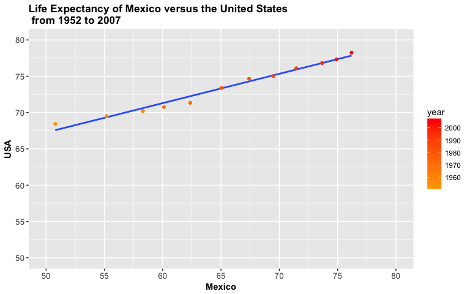

HW4 - Tidy data and joins
================
Alexi Rodriguez-Arelis
10/10/2017

Loading Libraries
-----------------

First of all, we need to load the corresponding libraries.

``` r
suppressPackageStartupMessages(library(tidyverse))
suppressPackageStartupMessages(library(gapminder))
suppressPackageStartupMessages(library(reshape2))
suppressPackageStartupMessages(library(dplyr))
knitr::opts_chunk$set(fig.width = 8, fig.height = 5)
```

Tasks
-----

### **1. General data reshaping and relationship to aggregation.**

I'm picking **Activity 2** : *Make a tibble with one row per year and columns for life expectancy for two or more countries.*

Let's take a look at our raw data:

``` r
knitr::kable(head(gapminder))
```

| country     | continent |  year|  lifeExp|       pop|  gdpPercap|
|:------------|:----------|-----:|--------:|---------:|----------:|
| Afghanistan | Asia      |  1952|   28.801|   8425333|   779.4453|
| Afghanistan | Asia      |  1957|   30.332|   9240934|   820.8530|
| Afghanistan | Asia      |  1962|   31.997|  10267083|   853.1007|
| Afghanistan | Asia      |  1967|   34.020|  11537966|   836.1971|
| Afghanistan | Asia      |  1972|   36.088|  13079460|   739.9811|
| Afghanistan | Asia      |  1977|   38.438|  14880372|   786.1134|

``` r
knitr::kable(tail(gapminder))
```

| country  | continent |  year|  lifeExp|       pop|  gdpPercap|
|:---------|:----------|-----:|--------:|---------:|----------:|
| Zimbabwe | Africa    |  1982|   60.363|   7636524|   788.8550|
| Zimbabwe | Africa    |  1987|   62.351|   9216418|   706.1573|
| Zimbabwe | Africa    |  1992|   60.377|  10704340|   693.4208|
| Zimbabwe | Africa    |  1997|   46.809|  11404948|   792.4500|
| Zimbabwe | Africa    |  2002|   39.989|  11926563|   672.0386|
| Zimbabwe | Africa    |  2007|   43.487|  12311143|   469.7093|

From `gapminder`, I'm subsetting countries Mexico and United States (since I'm interested in plotting `lifeExp` between my country and our neighbours from the States). From library `reshape2()`, I'm using function `spread()` to create two columns for both countries while keeping `year` as rows.

``` r
activity_2 <- gapminder %>%
  filter(country %in% c("Mexico", "United States")) %>%
  select(country, year, lifeExp) %>%
  spread(key = country, value = lifeExp)
knitr::kable(activity_2)
```

|  year|  Mexico|  United States|
|-----:|-------:|--------------:|
|  1952|  50.789|         68.440|
|  1957|  55.190|         69.490|
|  1962|  58.299|         70.210|
|  1967|  60.110|         70.760|
|  1972|  62.361|         71.340|
|  1977|  65.032|         73.380|
|  1982|  67.405|         74.650|
|  1987|  69.498|         75.020|
|  1992|  71.455|         76.090|
|  1997|  73.670|         76.810|
|  2002|  74.902|         77.310|
|  2007|  76.195|         78.242|

Now, we make a scatterplot of life expectancy for Mexico versus the United States as follows:

``` r
# Renaming contry columns
names(activity_2)[3] <- "USA"
ggplot(activity_2, aes(x = Mexico, y = USA)) + geom_smooth(method = 'lm', se = FALSE) + 
  geom_point(aes(colour = year)) + 
  scale_colour_gradient(low = "orange", high = "red") +
  scale_x_continuous(breaks = seq(50, 80, 5)) +
  scale_y_continuous(breaks = seq(50, 80, 5)) +
  coord_cartesian(xlim = c(50, 80), ylim = c(50, 80)) +
  theme(axis.text.x = element_text(size = 10),
        axis.text.y = element_text(size = 10),
        axis.title = element_text(size = 11, face = "bold"),
        plot.title = element_text(size = 13, face = "bold")) +
  ggtitle("Life Expectancy of Mexico versus the United States\n from 1952 to 2007")
```



We added a color gradient by year with `scale_colour_gradient()`, as well as a regression line with `geom_smooth()` which seems having a good fit for our data points. Note we force the y-axis to have the same scale as the x-axis with `coord_cartesian()`, since the the data spread in Mexico across the years is larger than in the United States. From this plot, we can see that Mexico has greatly improved its life expetancy to the point it gets closer to the United States during the 2000's.
